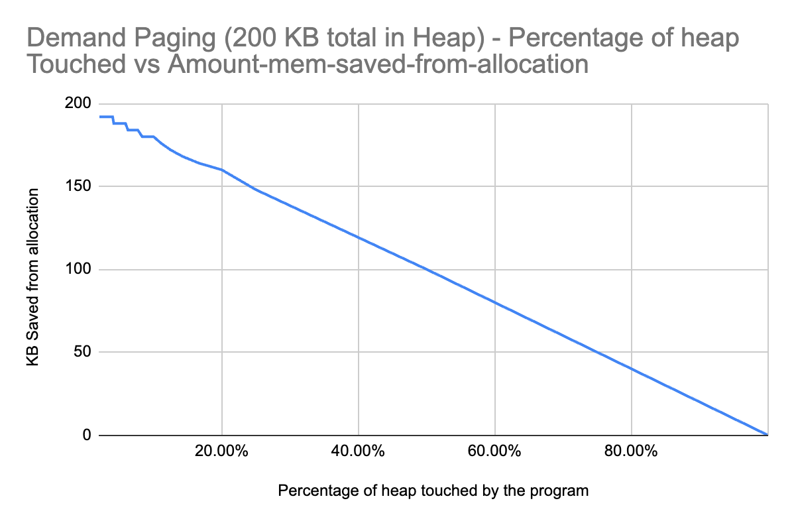
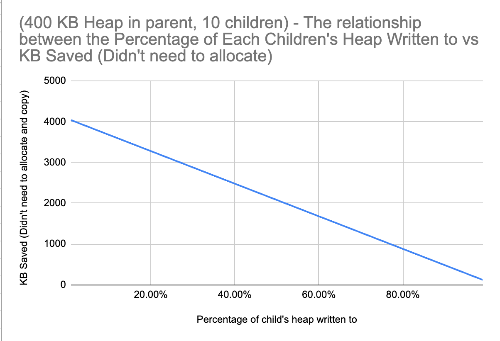
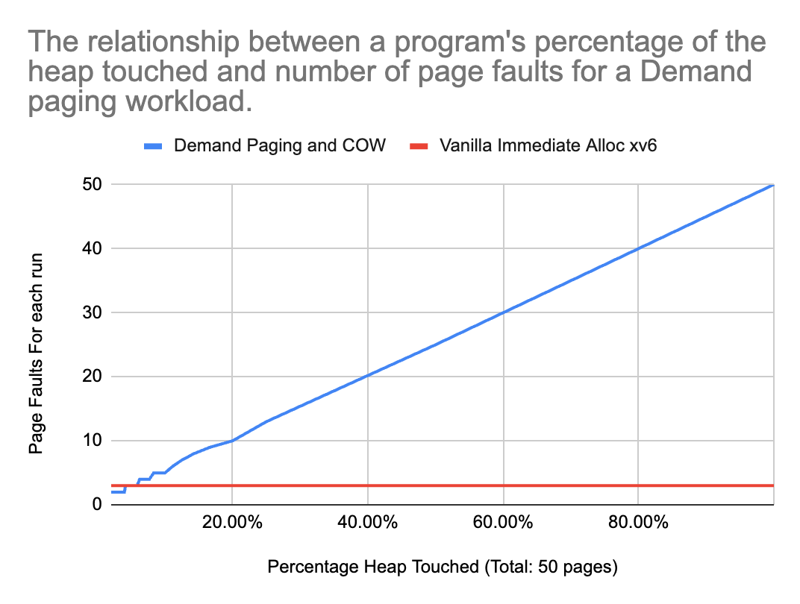
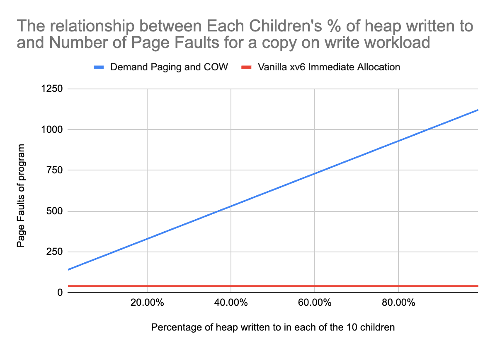
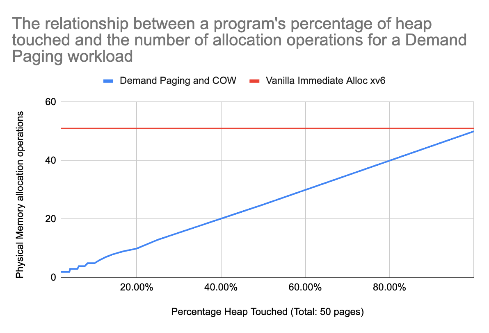
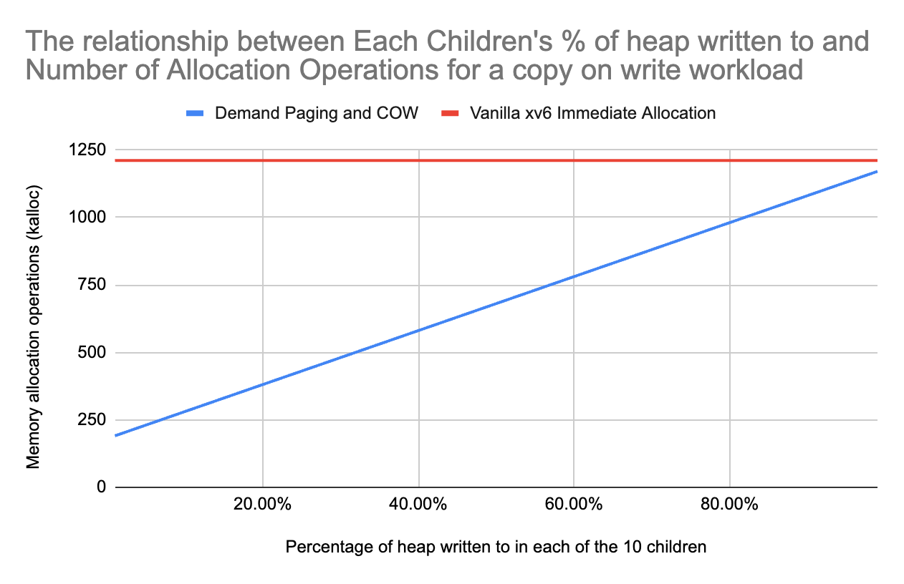

# Memory Optimization in xv6: Demand Paging and Copy-on-Write Implementation

This project implements two fundamental memory management techniques in the xv6 operating system: demand paging and copy-on-write (COW). These techniques are cornerstones of modern operating systems, significantly improving memory space efficiency for sparse workloads

## Project Overview

Memory management is a critical responsibility of any operating system kernel. This implementation enhances xv6's memory subsystem by adding:

1. **Demand Paging**: Deferring physical memory allocation until a page is actually accessed, reducing memory waste for sparse access patterns.

2. **Copy-on-Write (COW)**: Sharing memory pages between parent and child processes after fork() until a write occurs, avoiding unnecessary duplication.

## Technical Implementation

While these concepts appear straightforward, their implementation required careful consideration of kernel operations, page table management, and process interactions.

### Demand Paging Implementation

<details>
<summary><strong>Page Table Entry Modifications</strong></summary>

- Defined a custom `PTE_D` flag to mark pages that are mapped but not yet allocated
- Modified `uvmalloc()` in `vm.c` to support conditional allocation with a `force_alloc` parameter
</details>

<details>
<summary><strong>Trap Handler Extensions</strong></summary>

- Extended `usertrap()` in `trap.c` to handle page faults for demand-paged addresses
- Added logic to detect demand-paged entries (`PTE_D = 1` and `PTE_V = 0`)
- Implemented allocation and mapping logic to convert demand-paged entries to normal pages
- Added TLB flushing after page table modifications to maintain coherence
</details>

<details>
<summary><strong>Kernel-to-User Memory Operations</strong></summary>

- Modified `copyout()`, `copyin()`, and `copyinstr()` in `vm.c` to handle demand-paged memory (kernel operations)
- Implemented `walkaddr_demand_paged()` helper to allocate physical memory for demand-paged entries when accessed
- Added safeguards to properly handle invalid accesses, checking for permission bits and size constraints
- Ensured syscalls properly fail with -1 for user memory issues rather than causing kernel panics
</details>

<details>
<summary><strong>Process Management Integration</strong></summary>

- Modified `uvmcopy()` to ensure demand pages remain demand pages during fork
- Updated `uvmunmap()` to correctly handle demand-paged entries during memory deallocation
- Ensured proper behavior across the process lifecycle from creation to termination
</details>

### Copy-on-Write Implementation

<details>
<summary><strong>Page Sharing Mechanism</strong></summary>

- Added a custom `PTE_C` flag to mark pages shared through copy-on-write
- Modified `uvmcopy()` to share pages instead of duplicating them during fork
- Carefully preserved original page permissions, only applying COW to pages that were originally writable
- Maintained proper handling of demand-paged entries during fork operations in `uvmcopy()`
</details>

<details>
<summary><strong>Write Protection and Fault Handling</strong></summary>

- Extended the page fault handler to detect write attempts to COW pages (`PTE_C = 1` and `PTE_W = 0`)
- Implemented page duplication in `handle_cow_fault()` when a process attempts to modify a shared page
- Added proper reference count management during COW operations
- Ensured correct TLB coherence after modifying page table entries
</details>

<details>
<summary><strong>Kernel-to-User Write Handling</strong></summary>

- Modified `copyout()` in `vm.c` to handle COW pages when the kernel writes to user space
- Implemented page duplication for kernel-initiated writes to COW pages `handle_cow_fault` in `vm.c`
</details>

<details>
<summary><strong>Reference Counting System</strong></summary>

- Implemented a global kernel reference counter in `pa_track.h` to track shared physical pages
- Added proper synchronization using locks to prevent race conditions
- Integrated safe reference counting with page allocation and deallocation in `kfree()`
- Ensured correct cleanup to prevent memory leaks and use-after-free errors in `kalloc.c`, `kalloc.h` and other spots to update `cow_refcount`s such that we have updated information to decide whether to free physical pages on cleanup
</details>

## Performance Analysis

Despite the behaviour being predictable, I've implemented statistics to measure the behaviour of demand paging and copy on write. (I was not able to measure time due to the precision of `uptime()` in xv6, which only measures ticks and is only accurate to about ~10ms.)

### A Demand Paging workload (`dpcow_dpeff.c`) - Figures 1-3 
### A Copy on Write workload (`dpcow_encow.c`) - Figures 4-6

|DP Workload |COW workload|
|-|-|
| | |
| (Figure 1) | (Figure 4)|

Both Figure 1 and 4 demonstrates the space efficiency optimizations that is possible from sparse read/write workloads using demand paging and copy on write.

</br>


|DP Workload |COW Workload|
|-|-|
| | |
| (Figure 2) | (Figure 5)|

This demonstrates operational overhead of demand paging and COW, the amount of additional page faults caused by, respectively, touching PTE_D pages, and writing to PTE_C pages increases (Note: only `usertrap` is counted here because a kernel syscall will context switch anyway).

For Figure 5, say you have a 50% utilization of the heap, you'd have 15X more page faults than immediate allocation. 

However, this impact on my riscv-xv6 QEMU simulation is not noticable quantitatively when measured with ticks. Ticks are accurate to about ~10ms. Therefore, the total cost of page faulting has <= 10ms of impact per program in this test.

Note that the cost of page faulting may differ for different machines.


</br>

|DP Workload |COW Workload|
|-|-|
| | |
| (Figure 3) | (Figure 6)|

The dynamic number of allocation operations can be viewed as a pro and a con. 

Pro: the OS has less work <strong>in total</strong> since it allocates one by one. 

Con-the OS will have an extra step for each memory write/touch.

Whether this extra step from lazy allocation is a pro or a con depends on the specific operation being carried out. HFT may care more about speed of a single trade vs speed of a program sequence. Training a model would be better if the time taken and resource needed is overall reduced.

In general, we would care more about total runtime and the memory saved in total for the program. Therefore, more of a pro than a con.

<br/>

### Real-world Performance Analysis

To evaluate the practical benefits of demand paging and copy-on-write in a realistic scenario, I developed a server workload simulation (`dpcow_irl.c`) that models a typical application with shared configuration data, code segments, and varying client memory access patterns.

```
Memory efficiency metrics:
Total page faults:          34
  Demand paging faults:     25
  Copy-on-write faults:     9
Total allocations:          63

Memory sharing effectiveness:
COW pages initially shared: 105
COW pages eventually copied:8
COW sharing efficiency:     93%

Theoretical memory without DP/COW: 160 pages (640 KB)
Actual memory with DP/COW:        63 pages (252 KB)
Total memory savings:             97 pages (388 KB)
Only 39% of the originally needed memory got allocated.
```

The results were compelling: in a five-client test scenario, only 8 out of 105 shared COW pages requiring copy (allocation).

The system triggered 34 page faults across all clients (25 demand paging faults and 9 COW faults), demonstrating the expected overhead of these techniques.

More importantly, the implementation reduced memory consumption from a theoretical 640KB (without DP/COW) to just 252KB - a 39% reduction in memory footprint. This test demonstrates that in common scenarios where processes share significant portions of memory and access sparse regions of their address space, demand paging and copy-on-write can dramatically improve system memory efficiency with minimal performance impact.


<br/>

## Technical Challenges Overcome

<details>
<summary><strong>TLB Coherence Management</strong></summary>

Ensuring TLB coherence when modifying page table entries was critical for both demand paging and COW. When updating PTEs (for example, when transitioning a demand page to a regular page, or when duplicating a COW page), I implemented proper TLB flushing to prevent stale entries from causing incorrect address translation.
</details>

<details>
<summary><strong>Reference Counting Race Conditions</strong></summary>

Managing shared pages required careful synchronization to prevent race conditions. I implemented proper locking mechanisms in `pa_track.h`'s `cow_ref_lock` to ensure that reference counts remain accurate across concurrent operations from different processes.
</details>

<details>
<summary><strong>Chain Forking and Permission Preservation</strong></summary>

One of the most challenging aspects was correctly handling chain forking scenarios where COW pages themselves undergo fork operations. The key insight was preserving original page permissions during fork - pages that were read-only in the parent should remain read-only in the child without becoming COW pages, while writable pages should transition to COW status.
</details>

<details>
<summary><strong>Race Condition in Process Termination</strong></summary>

I discovered an interesting race condition in the xv6 scheduler during `sbrkfail` testing, where a process terminating due to allocation failure would sometimes not properly transition to zombie state before the parent's wait() call. This revealed deeper insights into process state transitions and scheduler behavior in xv6.
</details>

## Testing Methodology

The implementation was validated through:

1. **Custom Test Programs**: Purpose-built programs to stress-test demand paging and COW under various scenarios (`dpcow_cowtest.c`, `dpcow_basicmem.c`, `dpcow_exec.c`, `dpcow_forkch.c`, `dpcow_irl.c`)

2. **xv6 Usertests**: The standard xv6 test suite to ensure compatibility with existing code (`usertests.c`)

3. **Performance Benchmarks**: Measuring memory efficiency gains using controlled workloads (`dpcow_encow.c`, `dpcow_dpeff.c`)

## Future Directions

This implementation establishes a foundation for more advanced memory management techniques:

1. **Page Replacement Algorithms**: Implementing FIFO, LRU, or Clock algorithms for memory pressure scenarios
2. **Swap Space Support**: Adding the ability to move pages between memory and disk
3. **Memory Compression**: Implementing in-memory compression for rarely-accessed pages


## Acknowledgements

This implementation was built on and inspired by:
- The xv6 operating system (MIT)
- "Operating Systems: Three Easy Pieces" by Remzi H. Arpaci-Dusseau and Andrea C. Arpaci-Dusseau
- Linux kernel's memory management subsystem


## Author

Ji (Jerry) Qi - University of Toronto Student 
